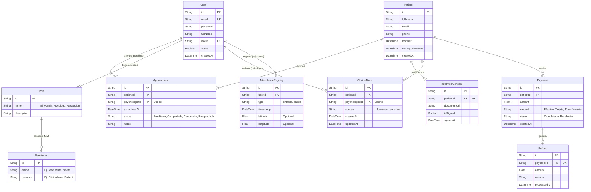

# Diagrama Entidad-Relación (CIPRE - Sistema de Gestión Clínica)

A continuación te presento el diagrama ER estructurado **específicamente para CIPRE**, basado en los módulos que hemos identificado (Pacientes, Agenda, Historial, Consentimientos, Pagos y Asistencia).

### 📋 Descripción de las Entidades del CRM (CIPRE)

1. **`User`, `Role` y `Permission` (RBAC - Roles y Permisos)**
   - El sistema de seguridad. En lugar de un simple texto, ahora `User` se enlaza a un `Role` específico. El `Role` contiene a su vez múltiples `Permission` (Permisos), lo que te permite decidir exactamente qué acciones (leer, escribir, borrar) puede hacer un rol sobre qué recursos (Pacientes, Notas, Pagos).
2. **`Patient` (Pacientes)**
   - Directorio central de pacientes de la clínica. Contiene información de contacto y campos calculados rápidos como `lastVisit`.
3. **`Appointment` (Agenda/Citas)**
   - Relaciona a un `Patient` con un `User` (específicamente con rol de Psicólogo). Controla los estados de reagendamiento.
4. **`InformedConsent` (Consentimientos Informados)**
   - Guarda el estatus legal de cada paciente. Es fundamental para recepción, indicando si el paciente ya firmó la documentación (`isSigned`).
5. **`ClinicalNote` (Historial Clínico)**
   - **Alta confidencialidad.** Relaciona las sesiones (o al paciente) con los apuntes del psicólogo. La base de datos debe contemplar reglas de acceso estrictas para que recepción jamás lea esto.
6. **`Payment` & `Refund` (Pagos y Devoluciones)**
   - Control financiero de las citas. `Refund` se asocia directamente a un pago previo en caso de una devolución por cita cancelada.
7. **`AttendanceRegistry` (Control de Acceso / Asistencia)**
   - Registra la trazabilidad operativa de tu equipo de trabajo para las horas de entrada y salida con su ubicación.
